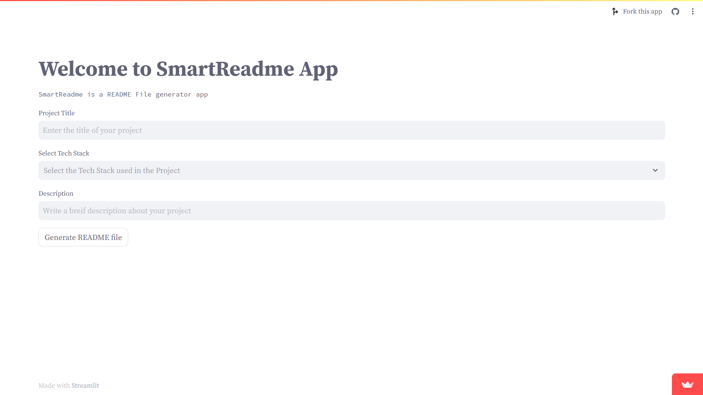

# SmartReadme

## Description
**SmartReadme** is a project that uses the power of [langchain library](https://python.langchain.com/docs/get_started/introduction) to generate README file content. It simplifies the process of creating comprehensive documentation for your projects.

## Demo
You can access the live demo of SmartReadme at [https://smartreadme.streamlit.app/](https://smartreadme.streamlit.app/).

## Screenshots

## Table of Contents
- [Screenshots](#screenshots)
- [Features](#features)
- [Technology Used](#technology-used)
- [Usage](#usage)
- [Deployment](#deployment)
- [License](#license)

## Features
- Generates README file content with ease.
- Simplifies the documentation process.
- Leverages the capabilities of [langchain library](https://python.langchain.com/docs/get_started/introduction).
- Provides a user-friendly interface.
- Streamlines project documentation tasks.

## Technology Used
- [langchain library](https://python.langchain.com/docs/get_started/introduction) - The primary technology stack for generating README content.

## Usage
To generate README content for your project, follow these steps:

1. Visit the live demo at [https://smartreadme.streamlit.app/](https://smartreadme.streamlit.app/).
2. Input your project details.
3. Click on the "Generate README" button.
4. Copy the generated content into your project's README.md file.

## Deployment
SmartReadme is deployed on Streamlit. You can access the live application at [https://smartreadme.streamlit.app/](https://smartreadme.streamlit.app/).

## License
This project is licensed under the MIT License - see the [LICENSE](LICENSE) file for details.